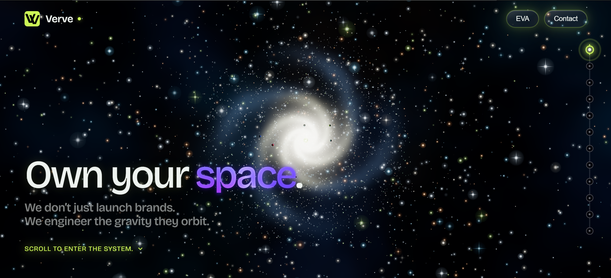

<div align="center">
  

  <h1>Verve</h1>

  <p><strong>A cinematic digital agency website where services orbit like planets.</strong></p>

  <p>
    <a href="https://verve-marketing.space/">Live Site</a>
    ·
    <a href="https://verve-marketing.space/core">The Core</a>
  </p>

  <p>
    
    
    
    
    
  </p>
</div>



> Own your space.

## Concept

Verve turns a service menu into a spatial brand system. Instead of asking visitors to scan a conventional agency page, the site moves them through a solar-system journey: every capability is a planet, every flyby reveals a concise value proposition, and the final stop is Mission Control.

The guided path is only half the experience. Visitors can enter **EVA mode** to break out of the scripted journey and freely orbit, pan, and zoom through the service system like an interactive brand universe.

The result is a portfolio-grade agency experience that feels immersive while still keeping the essentials intact: clear service pages, accessible content, search metadata, analytics, legal pages, and production-safe fallbacks.

## Experience

- **Scroll-driven galaxy journey** through the Verve service system.
- **Nine orbiting service planets** with custom shader-driven visual identities.
- **HUD-inspired timeline navigation** for jumping between mission points.
- **EVA/free-look mode** for breaking out of the guided scroll path and exploring the system manually.
- **Static service pages** generated from structured content.
- **Mission Control contact flow** with direct fallback contact options.
- **Cinematic brand language** built around gravity, orbit, launch, and momentum.

## EVA mode

EVA mode turns the site from a guided presentation into an explorable space. Visitors can leave the scroll sequence, take manual control, and move around the 3D system directly — orbiting planets, inspecting the scene, and opening service pages from planet labels.

It gives the website a second mode of interaction: structured storytelling when visitors scroll, free exploration when they want control.

## Built for production

- SEO metadata, canonical URLs, sitemap, robots.txt, structured data, and social preview cards.
- Google Analytics pageview and key interaction tracking.
- Semantic fallback content for search engines and non-visual users.
- WebGL capability checks, reduced-motion handling, and weaker-device render paths.
- Legal pages for privacy and terms.
- Canonical apex-domain redirect for the live site.

## System flow

```txt
Structured service data
        ↓
3D planets + flyby captions
        ↓
Timeline navigation + service pages
        ↓
Verve Core
        ↓
Mission Control CTA
```

## Design language

- Deep-space environment
- Glassmorphism interface layers
- Neon orbital accents
- Procedural planet shaders
- Minimal cinematic copy
- High-contrast dark UI
- Motion-led storytelling

## Quality checklist

- TypeScript strict mode
- Production build verified
- Responsive layout
- Reduced-motion aware
- SEO and social sharing metadata
- Accessible semantic fallbacks
- Analytics-ready conversion signals

## Services represented

1. Branding & Strategy
2. UI/UX Design
3. Web Development
4. Mobile App Development
5. SEO
6. Digital Marketing
7. Paid Advertising
8. Email Marketing
9. Cloud & DevOps Infrastructure

## Tech stack

| Area | Technology |
| --- | --- |
| Framework | Next.js App Router 16 |
| UI | React 19 |
| Language | TypeScript |
| 3D | Three.js, React Three Fiber, Drei |
| Effects | Postprocessing, custom GLSL shaders |
| Motion / scroll | Lenis + custom journey state |
| Styling | Global CSS |
| Analytics | Google Analytics |

## Routes

| Route | Purpose |
| --- | --- |
| `/` | Main cinematic service journey. |
| `/core` | Verve positioning, beliefs, and primary CTA. |
| `/services/[slug]` | Static service detail pages. |
| `/privacy` | Privacy Policy. |
| `/terms` | Terms of Use. |

## Local development

### Requirements

- Node.js 20.9+
- npm

### Install and run

```bash
npm install
npm run dev
```

Open [http://localhost:3000](http://localhost:3000).

### Production build

```bash
npm run build
npm run start
```

### Verification

```bash
npm run typecheck
npm run build
```

## Project structure

```txt
src/
  app/                  App Router pages, metadata, legal routes, sitemap, robots
  components/           UI, contact modal, journey controls, scene shell
  components/scene/     3D scene objects and controls
  data/                 Service content and visual data
  lib/                  Shared utilities, analytics, SEO, scroll/contact state
  shaders/              GLSL shader sources
public/                 Icons, social image, screenshot, and visual assets
```

## Status

The site is production-ready as a static agency experience. The contact form currently uses an email handoff; a server-side contact endpoint is planned.

## License

No open-source license is currently provided.

© 2026 Verve. All rights reserved.
